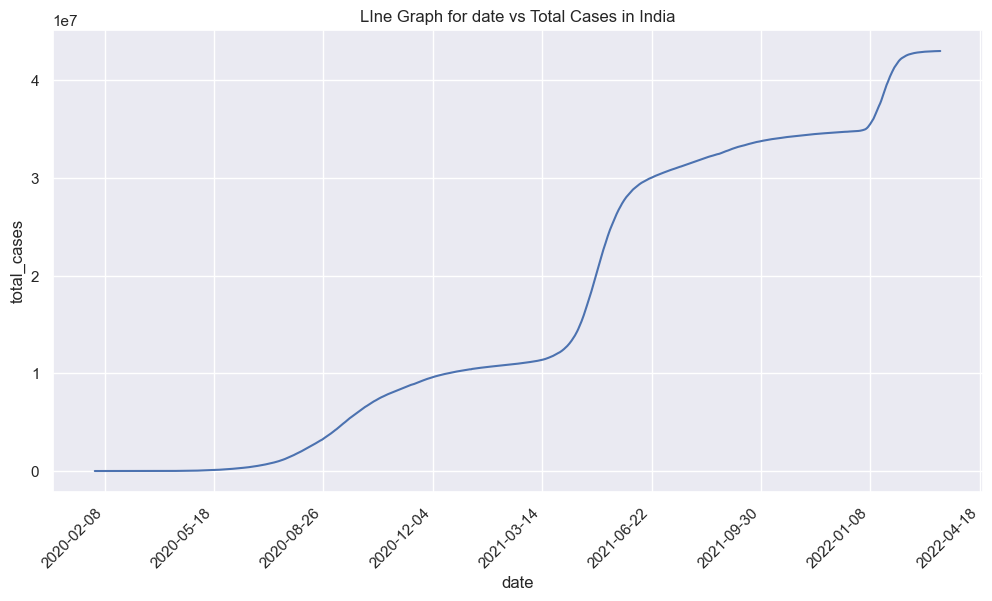
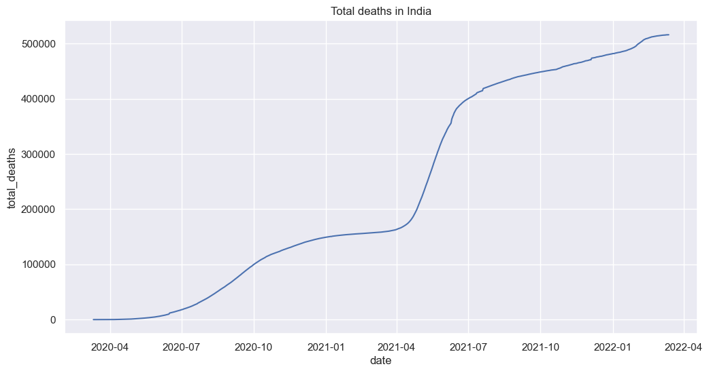
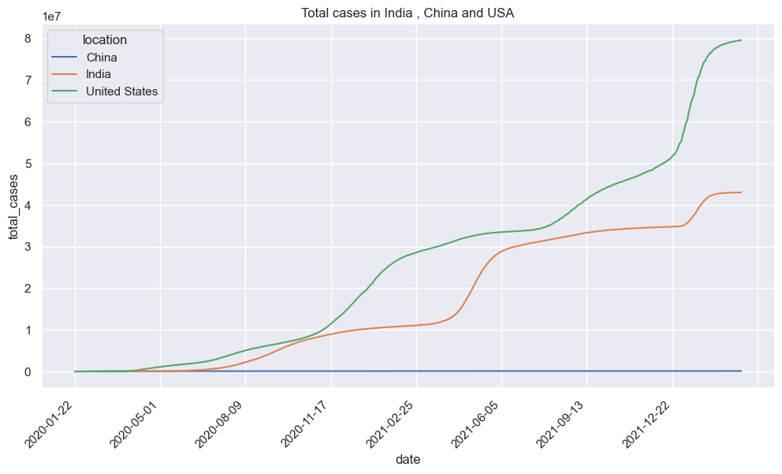
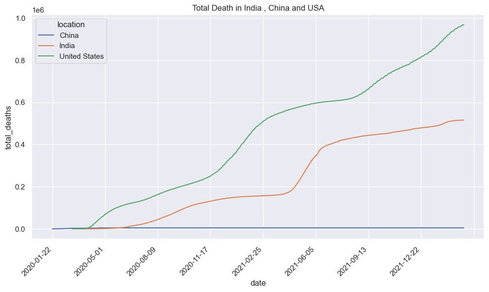
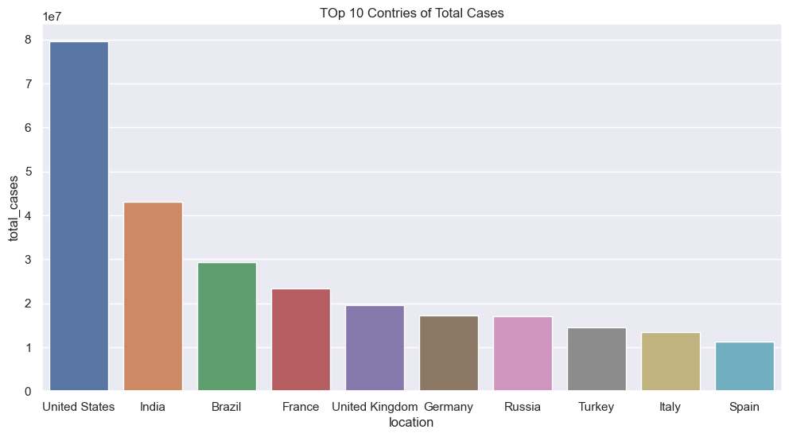
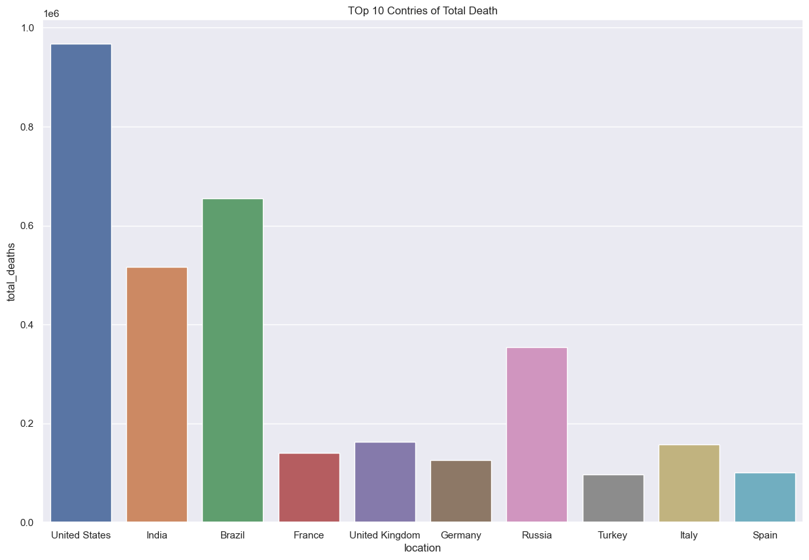

# Covid-19-Outbreak-Prediction-World-data-and-INDIA-data-

The coronavirus outbreak, also known as the COVID-19 pandemic, began in late 2019 in Wuhan, China. The virus responsible for the outbreak is called SARS-CoV-2, a novel coronavirus that primarily spreads through respiratory droplets when an infected person coughs, sneezes, or talks.

The COVID-19 pandemic has had a significant impact globally, affecting nearly every aspect of people's lives, including health, economies, and daily routines. It has resulted in millions of confirmed cases and deaths worldwide, leading to widespread concern and efforts to contain its spread.

### Showing the total no of records grouped by Continent
```js 
data["continent"].value_counts()
```
      Africa           39857
      Europe           37494
      Asia             36584
      North America    25203
      South America     9621
      Oceania           9345

### Line graph of Total cases in India
We can clearly see that in after summer the total cases of corona virus in India was increasing.



### Line graph of Total death in India



### Comparision of Total Cases And Total Death among India , China and USA

We can see that Corona first start from china . But there is no increase in total cases or total deaths in china in comparision with India and usa.





### Top 10 Contries having highest Total Cases And Total Death





* The United States has highest total cases of the coronavirus.
* Also United States has highest total death.
* India is the second country according to total COVID-19 cases, and Brazil is third.
* But according to total COVID-19 deaths Brazil is the second country, and India is Third.

`The data collected from the beginning of the coronavirus outbreak up until April 2022, but please note that the results may change in future.`

